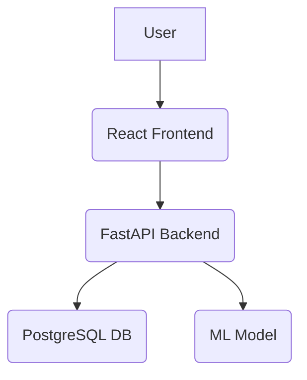

# Project Charter

This document is the single source of truth for project goals, scope, and technical context.
It should be updated as the project evolves, especially the DECISION LOG.

> 📚 For a high-level entry point and links to all documentation, see [README.md](../README.md).

## Project Overview

**Project Name:** [Enter the project's name here]

**Project Vision:** [Describe the long-term vision of the project. What is the ultimate goal?]

**Technical Goal:** [Describe the specific, measurable technical outcome of this project.]

**Repository:** [Link to the project's Git repository]

## Users & User Stories

### Primary Persona

**Target User:** [Describe the primary user of this project. Who are they, and what do they do?]

- **Name:** [Give the persona a name]
- **Role:** [What is their job title or role?]
- **Pain Points:** [What problems does this persona face that the project will solve?]
- **Goals:** [What does this persona want to achieve?]

### Core User Stories

As a [user type], I want [functionality] so that [benefit/value].

**Story 1:** As a [primary persona], I want to [main action] so that [primary benefit].

- Priority: Must-have

**Story 2:** As a [user type], I want to [supporting action] so that [supporting benefit].

- Priority: Should-have

## Features & Scope

**Core Features:** [List the core features of the project.]

For detailed documentation on specific features, data contracts, and models, refer to the `docs/api/`, `docs/data/`, and `docs/models/` directories respectively.

### Must-Have (MVP)

**Feature A:** [Describe a core feature for the Minimum Viable Product.]

- User Story: Story 1
- Implementation: [Link to the implementation task, e.g., a GitHub issue]
- User Impact: High

**Feature B:** [Describe another core feature for the MVP.]

- User Story: Story 2
- Implementation: [Link to the implementation task]
- User Impact: Medium

### Should-Have (Post-MVP)

**Feature C:** [Describe a feature that is important but not essential for the initial launch.]

- Implementation: [Link to the implementation task]

### Out of Scope

- [List any features or integrations that are explicitly out of scope for this project.]
- [This helps to manage expectations and prevent scope creep.]

## Architecture

### High-Level Summary

[Provide a brief summary of the project's architecture. What are the major components and how do they interact?]

### System Diagram

*This is an example diagram. Update it to reflect your project's architecture.*

### Folder Structure

- `/src`: Contains the main source code for the project.
- `/docs`: Contains all project documentation, including planning, guides, and logs.
- `/notebooks`: Contains Jupyter notebooks for experimentation and analysis.
- `/data`: Contains raw, interim, and processed data (not versioned by Git).
- `/tests`: Contains all unit, integration, and functional tests.

## Technology Stack

| Category | Technology | Version | Notes |
|----------|------------|---------|-------|
| Package Management | uv | latest | High-performance Python package manager and resolver |
| Core Language | Python | 3.11+ | Primary programming language |
| Linting & Formatting | Ruff | latest | Combines linting, formatting, and import sorting |
| Experiment Tracking | MLflow | latest | For managing the ML lifecycle, including tracking experiments |
| Data Lineage | OpenLineage | latest | For collecting data lineage metadata |
| Testing | Pytest | latest | Framework for writing and running tests |
| Documentation | MkDocs | latest | Static site generator for project documentation |
| Orchestration | Prefect | latest | Workflow orchestration and scheduling |

## Risks & Assumptions

### Key Assumptions

**User Behavior:** We assume users will [describe an assumption about user behavior].

- Validation: [How will you validate this assumption? E.g., user interviews, A/B testing]

**Technical:** We assume [describe a technical assumption, e.g., about a library or API].

- Validation: [How will you validate this assumption? E.g., proof of concept, load testing]

### Technical Risks

| Risk | Probability | Impact | Mitigation |
|------|-------------|--------|------------|
| [Describe a potential technical risk] | [Low, Medium, High] | [Low, Medium, High] | [How will you mitigate this risk?] |
| Third-party API failure | Medium | High | [Implement a fallback or retry mechanism] |

## Decision Log

*Key architectural and product decisions will be recorded here as the project evolves.*

---

*This document consolidates the project definition, technical context, and scope appendix into a
single source of truth.*
